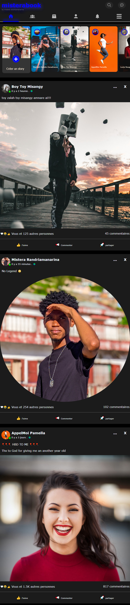

# Le PROJET CLONE FACEBOOK

## Bonjour, ici ElgissioFranito 🖐

#### Cet répertoire est mon premier projet clone.
Je veut cloner le célèbre siteweb facebook que j'ai nommé 
## misterabook
Je vais le cloner en maquête (avec adobeXD), en front-End (avec HTML5, CSS3, si je peux avec Angular11), et enfin en back-End (j'hésite encore entre Node.JS et PhP) 

## Il s'agit en fait de l'application 
# facebook_mobile

### Voici ce que j'ai déjà accompli 

Je viens de terminer page d'acceuil facebook (en Html/Css/JS). J'ai fais pas mal de dynamisme dans la page, mais malheuresement ça ne se voit pas sur l'image, car c'est un capture d'écran. En  tant que développeur web junior, je vais devoir faire encore beaucoup de chémin pour mettre en marche cette appication web.
Je vais pas me décourager pour autant!

Merci pour la lecture.

# à bientôt pour la suite! ✌👍
